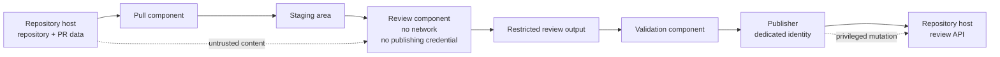

# STRIDE-Flavored Security Disclosure Example

## Purpose

This document provides a worked example illustrating the
[Security Disclosure Standard](../../../general/security/disclosure.md) and its
use of STRIDE as a commonly recognized threat-modeling vocabulary.

The example is illustrative rather than normative.  The governing security
standards define the requirements.  A real repository should adapt the depth,
controls, evidence, and residual-risk discussion to its own architecture and
consequences.

The system described below is hypothetical.

## Scenario

Assume a repository uses an automated review workflow with five stages:

1. a pull component retrieves a repository and pull-request metadata;
2. a staging component prepares the review input;
3. an AI review component analyzes the staged material without network access or
   publication credentials;
4. a validation component accepts only a constrained review result; and
5. a publisher posts the validated review to the hosting service using a
   dedicated publishing identity.

The review component may read untrusted repository and pull-request content.
That content may contain text attempting to influence the reviewer, invoke tools,
request network access, disclose secrets, or cause the publisher to perform an
operation other than posting review text.

The architecture deliberately separates analysis from publication.

## Architecture

The two most important boundaries are:

- untrusted repository content entering the review component; and
- review output crossing into the privileged publisher path.

## Assets

The system is intended to protect:

- repository-host credentials;
- publication authority;
- repository and pull-request integrity;
- confidential environment or infrastructure information;
- the integrity of the review content;
- attribution of published reviews; and
- availability of the review service.

## Actors and Identities

The relevant actors are:

- repository users who can influence pull-request content;
- the pull component;
- the review component;
- the validation component;
- the publisher;
- the repository-host service; and
- maintainers who configure the workflow.

The review component has no authority to publish repository changes.

The publisher uses a dedicated workload identity with only the repository-host
permissions required to publish review comments.

## Security Claims

This design makes the following scoped claims.

### Claim 1: Pull-request content cannot directly grant publication authority

Repository content, issue text, pull-request metadata, comments, and generated
review input are treated as data rather than authority.

The review component does not possess the credential used to publish comments.

### Claim 2: The review component cannot initiate arbitrary network requests

The review component runs without network capability.

A request embedded in repository content cannot cause the review component to
contact an external service directly.

### Claim 3: Review output is not interpreted as publisher control

The interface between the review component and publisher carries review data, not
arbitrary publisher commands.

The validation component rejects output that does not satisfy the expected review
schema and limits.

### Claim 4: Publication is attributable to a dedicated workload identity

The publisher authenticates to the repository host using a dedicated identity
whose permissions are limited to the required publication operation.

## Assumptions

These claims depend on several assumptions:

- the runtime actually enforces the review component's network restriction;
- the review component cannot read the publisher credential through another
  mounted path, environment variable, process interface, or inherited descriptor;
- filesystem permissions prevent the review component from modifying publisher
  code or configuration;
- the publisher accepts only validated review output;
- repository-host authorization correctly enforces the publishing identity's
  configured permissions;
- the host running the workflow is not already compromised;
- the validation component itself has not been maliciously modified; and
- maintainers protect the configuration that defines these boundaries.

If one of these assumptions fails, the related security claim may no longer hold.

## Trust Boundaries

### Boundary A: Repository Host to Pull Component

Inputs include repository contents, pull-request metadata, filenames, commit
metadata, issue text, and comments.

These inputs are authenticated only to the extent provided by the repository
host.  Their contents remain externally influenced and are not treated as
instructions to the workflow.

### Boundary B: Pull and Staging to Review Component

The review component consumes externally influenced material.

This boundary is deliberately one-way with respect to authority: input may affect
the substance of the review, but it does not grant additional tools, network
access, credentials, or publisher capabilities.

### Boundary C: Review Component to Validation Component

Review output remains untrusted data.

The validation component establishes the invariants required by the publishing
interface, including structure, size, supported operation, and permitted target.

### Boundary D: Validation Component to Publisher

This is a privilege boundary.

The publisher receives only the data required for a specific publication
operation.  It does not accept arbitrary commands, shell fragments, URLs,
repository operations, or credential-selection requests from the review output.

### Boundary E: Publisher to Repository Host

The publisher crosses a network and authorization boundary.

The connection uses authenticated encrypted transport, and the repository host
authorizes the workload identity for the requested operation.

## STRIDE Analysis

STRIDE is used here because it gives reviewers a commonly recognized vocabulary.
The example does not assume that STRIDE is superior to other suitable
threat-modeling methods.

### Spoofing

**Threat:** An attacker impersonates the publisher and posts a review that appears
to originate from the automated workflow.

**Controls:**

- use a dedicated publisher identity;
- protect its private credential outside the review component;
- validate the repository-host endpoint;
- use authenticated encrypted transport; and
- rotate or revoke the credential after suspected compromise.

**Evidence:**

- integration tests demonstrate that publication fails without the publisher
  credential;
- repository-host configuration shows the dedicated workload identity; and
- permission inspection confirms that the review component cannot read the
  credential.

**Residual risk:**

A compromised publisher credential can still be used by an attacker until it
expires or is revoked.

### Tampering

**Threat:** Repository content, staged input, review output, or publisher input is
modified between stages so that the published review differs from the intended
review.

**Controls:**

- isolate writable directories by stage;
- prevent the review component from modifying publisher code or configuration;
- validate review output before publication;
- constrain the publisher to a narrow input schema; and
- preserve attributable logs across the validation and publication stages.

**Evidence:**

- permission tests verify expected read and write boundaries;
- negative tests demonstrate rejection of malformed publisher input; and
- integration tests compare validated review content with published review
  content.

**Residual risk:**

A compromised host or validation component may still alter data while preserving
the expected application-level interfaces.

### Repudiation

**Threat:** A consequential review is published without enough evidence to
determine which workflow execution produced it.

**Controls:**

- use a dedicated publisher identity;
- record the repository, pull request, source revision, workflow execution, and
  publication result;
- correlate publisher logs with repository-host audit records; and
- avoid logging secrets or unnecessary pull-request contents.

**Evidence:**

- integration tests verify that required correlation identifiers are emitted; and
- operational review confirms that repository-host audit records identify the
  publisher identity.

**Residual risk:**

Audit records may be incomplete, unavailable, or compromised independently of the
publishing path.

### Information Disclosure

**Threat:** Untrusted pull-request content causes credentials, filesystem data,
environment data, or unrelated repository information to appear in the review or
be sent to an external service.

**Controls:**

- give the review component no publishing credential;
- deny unnecessary network access;
- restrict readable filesystem paths;
- minimize inherited environment variables;
- validate review output before publication; and
- avoid placing secrets in review input.

**Evidence:**

- tests demonstrate that network access is unavailable from the review component;
- permission tests demonstrate that secret locations cannot be read;
- environment inspection confirms that publishing credentials are absent; and
- adversarial tests include requests to reveal files, environment values, and
  credentials.

**Residual risk:**

Sensitive information already present in repository content may legitimately be
visible to the reviewer and may appear in generated review text unless additional
redaction or classification controls are used.

### Denial of Service

**Threat:** Very large, malformed, recursive, or adversarial repository content
exhausts storage, memory, CPU, model context, or publication capacity.

**Controls:**

- bound repository and review-input size;
- impose execution time and resource limits;
- limit review-output size;
- reject unsupported or pathological input before expensive processing; and
- prevent a failed review from blocking unrelated repository operations.

**Evidence:**

- boundary tests cover maximum accepted input and output sizes;
- timeout tests exercise pathological analysis cases; and
- operational metrics expose repeated resource exhaustion.

**Residual risk:**

A sufficiently expensive but valid pull request may still consume significant
review capacity and delay other reviews.

### Elevation of Privilege

**Threat:** Untrusted content persuades or causes the review component to acquire
publisher authority, execute privileged commands, access unrelated files, or
request a broader repository-host operation.

**Controls:**

- separate review and publisher processes;
- withhold publisher credentials from the review component;
- deny unnecessary network access;
- constrain filesystem visibility;
- expose no generic privileged command channel;
- validate output against a narrow publication schema; and
- authorize publication independently at the publisher and repository-host
  boundaries.

**Evidence:**

- adversarial tests include instruction-like content requesting tool use,
  credential access, command execution, and publication of unrelated actions;
- permission tests confirm that the review component lacks the relevant
  capabilities; and
- publisher tests reject unsupported operations even when requested by validly
  structured review data.

**Residual risk:**

A vulnerability in the runtime, isolation mechanism, validation component, or
publisher may allow a boundary escape despite the intended capability model.

## Controls Summary

The principal controls are:

- separate identities for analysis and publication;
- absence of publisher credentials from the review environment;
- network denial for the review component;
- constrained filesystem access;
- separation of data from control;
- validation at the privileged boundary;
- authenticated encrypted publisher transport;
- least-privilege repository-host authorization;
- bounded resource consumption;
- audit correlation; and
- positive, negative, adversarial, and integration tests.

These controls reduce risk.  They do not prove that the system is universally
secure.

## Evidence Summary

Evidence for this design should include, as applicable:

- runtime configuration showing the network restriction;
- filesystem and mount configuration;
- credential-injection configuration;
- repository-host permission configuration;
- tests for malformed review output;
- tests for unauthorized publisher operations;
- adversarial prompt-injection-style inputs;
- tests demonstrating unavailable network and credential capabilities;
- review-size and execution-time boundary tests; and
- audit records showing attributable publication.

The evidence establishes only the properties exercised or inspected.

## Known Limitations

This design does not establish that:

- the host operating system is uncompromised;
- the model or review engine cannot generate incorrect or harmful review text;
- the repository host cannot be compromised;
- every possible covert channel has been eliminated;
- the publisher credential can never be stolen;
- all sensitive repository content can be identified automatically; or
- resource limits eliminate every denial-of-service condition.

The design relies on containment and independent privileged mediation rather than
on assuming that the review component will always behave correctly.

## Accepted Compromise

Assume the repository host does not support mutual TLS for its public review API.

The preferred control for critical tooling under common administrative control
would be mutual cryptographic authentication.  That control is unavailable at
this external boundary.

The publisher therefore uses:

- HTTPS with normal server certificate validation; and
- the repository host's supported workload credential for client authentication.

The residual risk is that client authentication depends on a bearer-style or
platform-provided credential rather than a mutually authenticated TLS identity.

This compromise is accepted because the external service controls the supported
authentication mechanisms.  It should be revisited if the service later provides
a suitable stronger mechanism.

## Residual Risk Summary

After the documented controls, material residual risks include:

- compromise of the execution host;
- compromise or theft of the publisher identity;
- vulnerabilities in isolation or validation mechanisms;
- disclosure of sensitive data that already exists in reviewable repository
  content;
- resource exhaustion from expensive but valid inputs; and
- incorrect or misleading review content that still satisfies the publication
  schema.

Users should not interpret a published automated review as proof that the reviewed
change is safe, correct, or free of vulnerabilities.

## Review Triggers

Revisit this disclosure when:

- the review component receives a new tool or capability;
- network access is enabled or broadened;
- filesystem access changes;
- publication credentials or repository-host permissions change;
- the review-output schema changes;
- review output gains the ability to request more than one operation type;
- the repository host changes authentication mechanisms;
- a security incident crosses one of the documented boundaries;
- the execution environment or isolation technology changes; or
- material evidence shows that an existing assumption is incorrect.

## Relationship to the Security Commandments

This example particularly illustrates:

- **SEC-02**: treat external influence as tainted;
- **SEC-03**: data does not grant authority;
- **SEC-04**: separate identity from authority;
- **SEC-05**: validate for the sink;
- **SEC-06**: re-establish trust at boundaries;
- **SEC-07**: grant the least capability;
- **SEC-08**: protect consequential crossings;
- **SEC-09**: design for failed assumptions;
- **SEC-10**: fail closed when assurance is required;
- **SEC-11**: test the claim, not the slogan; and
- **SEC-12**: disclose uncertainty and residual risk.

## Takeaway

A useful security disclosure does more than list controls.

It states what the system claims, identifies what those claims depend on, applies a
repeatable threat vocabulary to meaningful boundaries, connects threats to
controls and evidence, states what the evidence does not prove, and leaves the
remaining risk visible for reviewers and users.
