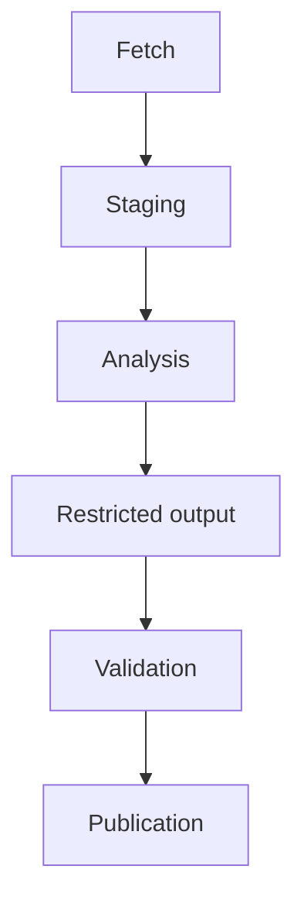
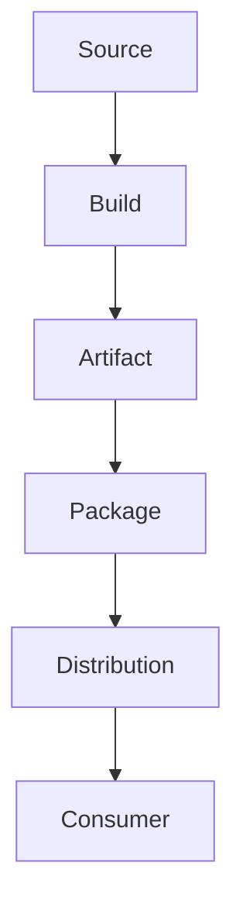

# Security Architecture Standard

## Purpose

This standard defines architectural practices for making trust boundaries
explicit, limiting authority, containing compromise, and reducing the amount of
trust required for a system to operate.

Architecture is the A in IDEA.

This standard complements the
[Clean Architecture Standard](../clean-architecture-standard.md).  Clean
Architecture protects important software policy from unnecessary implementation
coupling.  Security Architecture protects assets and authority from unnecessary
trust and reachability.

## Identify Assets and Boundaries

Security-sensitive architecture SHOULD identify the assets that require
protection.

Assets MAY include:

- source code;
- credentials;
- signing keys;
- release artifacts;
- user data;
- deployment environments;
- repositories;
- configuration;
- security policy;
- audit records; and
- availability of critical services.

Material trust boundaries SHOULD be visible in architecture or security
documentation.

A trust boundary exists wherever identity, authority, data, or control moves
between contexts that should not share identical assumptions.

## Model Data and Control Flows

Architectures SHOULD distinguish:

- data flow;
- control flow;
- credential flow;
- privilege transitions;
- network flow; and
- persistence boundaries.

The same connection may carry more than one of these.

Security-sensitive diagrams SHOULD make important privilege transitions visible
rather than drawing every component as an equally trusted peer.

## Local Is Still a Boundary

A process boundary, filesystem boundary, repository boundary, privilege boundary,
container boundary, or pipeline stage can be security-relevant even when every
component runs on the same host or internal network.

Network topology MUST NOT be used as the sole definition of trust.

## Compartmentalize Responsibilities

Components with materially different responsibilities SHOULD be separated when
doing so reduces authority or blast radius.

For example:

A component that fetches data need not publish it.

A component that analyzes untrusted content need not possess network or repository
mutation credentials.

A publisher need not execute the content it publishes.

## Separate Privileged Operations

Privileged operations SHOULD cross narrow, explicit interfaces.

A more privileged component SHOULD validate requests received from a less
privileged component according to its own contract.

The privileged component MUST NOT delegate its authority merely because the
request originated from an internal stage.

This is especially important for:

- release publication;
- deployment;
- repository mutation;
- credential issuance;
- secret access;
- security-policy changes; and
- infrastructure administration.

## Separate Data and Control Planes

Architectures SHOULD distinguish data from instructions and policy.

Where external or less-trusted data can influence control, the transition SHOULD
be explicit and threat-modeled.

Examples include:

- CI workflow definitions;
- plugin loading;
- deployment manifests;
- policy files;
- generated shell commands;
- agent tool requests; and
- configuration that selects privileged behavior.

Data SHOULD NOT silently become control.

## Restrict Network Reachability

Components SHOULD have access only to the network destinations required for their
responsibilities.

A component that does not require network access SHOULD have no network
capability where practical.

Network restrictions SHOULD be enforced independently of application intent when
the consequence of misuse is material.

Service-to-service access SHOULD use explicit identities and authorization rather
than relying solely on subnet membership or network location.

## Restrict Filesystem Reachability

Components SHOULD have access only to filesystem regions required for their
responsibilities.

Architectures SHOULD consider separate:

- read-only source areas;
- writable working areas;
- output areas;
- credential locations;
- publication staging areas; and
- persistent state.

One-way or write-only interfaces MAY be useful when a component should produce
data without later reading or altering what a more privileged component will
consume.

Filesystem permissions are part of the architecture when they enforce a trust
boundary.

## Restrict Process and Execution Authority

Components SHOULD receive only the process-control and execution capabilities
they need.

Architecture SHOULD avoid combining:

- arbitrary command execution;
- broad filesystem mutation;
- unrestricted network access; and
- privileged credentials

in one component unless its responsibility genuinely requires all of them.

Where practical, place high-risk interpretation or analysis in a lower-privilege
compartment and mediate consequential actions elsewhere.

## Isolate Credentials

Credentials SHOULD remain in the smallest architectural domain that needs them.

A credential used by a publisher SHOULD not be available to an unrelated analyzer
or parser.

Distinct privileged stages SHOULD use distinct identities where practical.

## Protect Transformations

Builds, generators, minifiers, packagers, converters, and publishers transform
data across trust boundaries.

Architectures SHOULD identify which transformations are security-sensitive and
which provenance must survive them.

For important artifacts, consider a chain such as:

Each stage should have only the authority required for its role.

A trusted source tree does not make the output of an uncontrolled build process
trusted automatically.

## Design for Failure and Compromise

Architecture SHOULD assume that individual controls can fail.

Containment strategies MAY include:

- separate processes;
- containers or sandboxes;
- distinct service identities;
- separate credentials;
- read-only mounts;
- bounded writable directories;
- network egress restrictions;
- resource limits;
- independent validation;
- staged publication; and
- one-way data movement.

The goal is to prevent one incorrect trust decision from granting unrelated
authority.

## Availability Is Part of Security

Security architecture SHOULD consider denial of service and operational
dependency.

A security control that creates an unacceptable single point of failure may need
redundancy, caching, graceful degradation, or another availability design.

A degraded mode that weakens security MUST be explicit and disclosed.

## Posture and Continuous Verification

Identity alone does not establish the integrity of the environment using that
identity.

Where consequence warrants it, authorization MAY consider posture such as:

- expected software version;
- expected artifact or image digest;
- patch state;
- deployment environment;
- configuration state;
- execution identity; and
- required security controls.

Posture checks SHOULD be selected for meaningful risk reduction rather than as
decorative compliance signals.

## Recovery and Re-establishment of Trust

Architecture SHOULD consider how trust is restored after compromise or suspected
compromise.

Recovery MAY require:

- credential rotation;
- certificate revocation;
- replacement of trust anchors;
- artifact rebuild;
- environment re-provisioning;
- audit review;
- reauthorization; and
- restoration from verified state.

A design that can establish trust only once but cannot recover from its loss is
operationally incomplete for critical systems.

## Threat Modeling Inputs

Architecture SHOULD provide the information necessary for threat modeling under
the [Disclosure Standard](disclosure.md).

At minimum, a consequential design should make it possible to identify:

- assets;
- actors;
- components;
- flows;
- trust boundaries;
- privilege transitions;
- external dependencies;
- persistence; and
- recovery assumptions.

STRIDE analysis belongs primarily to Disclosure, while Architecture owns the
system structure being analyzed.

## Relationship to Identity Management

Architecture defines where identities are required and where authorization is
enforced.

The [Identity Management Standard](identity-management.md) governs how those
identities, credentials, and authorities are established and maintained.

## Relationship to Engineering

Architecture constrains what should be possible.

[Engineering](engineering.md) implements those constraints and creates evidence
that they operate as intended.

Where an architectural boundary relies only on implementation convention, the
project SHOULD consider whether a stronger external enforcement mechanism is
practical.

## Review Questions

When reviewing security architecture, consider:

- What assets are we protecting?
- Where are the trust boundaries?
- What data crosses each boundary?
- What control information crosses each boundary?
- Which components possess credentials?
- Which components can reach the network?
- Which components can mutate persistent state?
- Which components can execute arbitrary commands?
- Can less-privileged output become privileged control?
- Can one compromised component move laterally into unrelated authority?
- Are build and transformation boundaries visible?
- Is availability protected against predictable abuse?
- Can credentials and trust anchors be rotated after compromise?
- Can the system re-establish trust after a security incident?
- Is enough architecture documented to support meaningful STRIDE analysis?

## Guidance for Automated Agents

When proposing architecture, an agent SHOULD:

1. identify assets and trust boundaries;
2. separate data, control, credential, and privilege flows;
3. minimize capabilities per component;
4. isolate credentials;
5. avoid unnecessary network and filesystem reachability;
6. mediate privileged transitions;
7. separate analysis from publication or mutation when practical;
8. preserve provenance across important transformations;
9. design for containment when a component is compromised;
10. consider availability and recovery;
11. provide enough information for Disclosure threat modeling; and
12. identify when the change is consequential enough to require an ADR.

An agent MUST NOT collapse boundaries merely because combining components would
be simpler.

## Governing Principle

Architecture should reduce how much any component must be trusted and how much
damage a failed trust assumption can cause.
