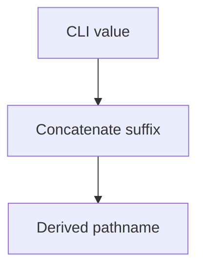

# Security Engineering Standard

## Purpose

This standard defines implementation and verification practices for enforcing the
security model described by the security corpus.

Engineering is the E in IDEA.

## Treat External Data as Tainted

Data influenced outside the current component SHOULD be treated as tainted until
the properties required for a specific use have been established.

Common sources include:

- command-line arguments;
- environment variables;
- files and file metadata;
- standard input;
- configuration;
- network input;
- API responses;
- database records;
- subprocess output;
- directory listings;
- repository content;
- issue, pull-request, and commit metadata;
- generated artifacts;
- package metadata;
- service-discovery results; and
- AI-generated output.

Local origin MUST NOT be treated as proof of safety.

A local file, local environment variable, current working directory, or value from
a trusted repository can still be malformed, maliciously influenced, stale, or
unsuitable for the intended sink.

## Taint Propagates

When tainted data materially contributes to a derived value, the derived value
SHOULD remain externally influenced until the receiving use establishes its
required invariant.

For example:

Adding a trusted suffix does not make the pathname generally trustworthy.

Parsing, serialization, encoding, escaping, hashing, case conversion, and
normalization do not by themselves remove taint.

## Validate for the Intended Use

There is no universal sanitized state.

Validation SHOULD establish the invariant required by a particular sink.

A value validated as a repository identifier is not thereby validated as:

- a shell fragment;
- a filesystem path;
- a URL component;
- a Git reference;
- a SQL identifier;
- a container image name; or
- an authorization target.

Allow-list validation SHOULD be preferred when a bounded grammar can be defined.

Reject invalid data rather than attempting to enumerate every dangerous value.

## Validate at the Point of Use

Early validation is useful but does not eliminate the responsibility of a later
trust boundary.

A receiving component SHOULD validate the properties it relies upon.

This prevents assumptions made for one context from being silently reused in
another.

## Canonicalization and Normalization

When several representations can refer to the same resource, validation SHOULD
consider canonicalization or normalization before making a security-sensitive
decision.

Examples include:

- relative and absolute paths;
- symbolic links;
- case-insensitive identifiers;
- percent-encoded URL components;
- Unicode normalization; and
- alternate hostname representations.

Canonicalization MUST NOT itself be treated as authorization.

The canonical result still needs to satisfy the intended policy.

## Data Must Not Become Control Accidentally

Externally influenced data SHOULD NOT be interpreted as executable control when a
non-executable representation is available.

Avoid, where practical:

- shell evaluation of constructed strings;
- dynamic function or method names from unvalidated input;
- executable configuration for ordinary data;
- unsafe deserialization;
- generated code used as a control channel;
- template expansion directly into commands; and
- treating repository or issue content as agent instructions.

Prefer structured data and explicit dispatch tables over evaluation.

## Subprocess Execution

When invoking subprocesses, pass arguments as distinct argument-vector elements
rather than constructing a shell command string when the platform supports it.

Do not invoke a shell merely for convenience when external input can influence
the command.

Executable selection SHOULD avoid uncontrolled search paths in privileged or
security-sensitive contexts.

Environment variables inherited by privileged subprocesses SHOULD be minimized or
set to known values where practical.

## Filesystem Boundaries

Filesystem operations SHOULD constrain both the requested path and the authority
of the process performing the operation.

A syntactically valid path is not necessarily an authorized path.

Security-sensitive filesystem code SHOULD consider:

- traversal;
- symbolic links;
- race conditions;
- unexpected file types;
- ownership and permissions;
- temporary-file creation;
- canonical root boundaries;
- device files and special files; and
- atomic replacement where integrity matters.

Processes SHOULD have access only to the filesystem regions they require.

## Environment Variables

Environment variables are external input.

Security-sensitive code MUST NOT assume environment values are trustworthy merely
because the process inherited them.

Where a privileged operation depends on variables such as search paths,
configuration selectors, locale, or command behavior, the process SHOULD use a
known safe environment or validate the required values.

## Configuration

Configuration is data unless the project explicitly defines it as executable
policy.

Configuration values SHOULD be validated before they influence privileged
operations.

A configuration file's location inside the repository does not establish that all
of its values are authorized for every use.

## Network Transport

HTTP traffic MUST use HTTPS unless an explicit documented exception is accepted
under the Disclosure Standard.

Certificate verification MUST NOT be disabled merely to make a connection
succeed.

Critical tooling SHOULD authenticate both service and client.  Where both
endpoints are controlled by the project or organization, mutual TLS or an
equivalent mutually authenticated mechanism SHOULD normally be used.

External services that do not support the preferred mechanism MAY require a
weaker control.  Material limitations and compensating controls MUST be
disclosed.

## Data-Level Integrity and Provenance

TLS protects a transport session.  It does not provide durable provenance after
termination.

Artifacts or messages whose integrity or origin must survive transport
termination, persistence, caching, queuing, or multiple intermediaries SHOULD use
cryptographic signatures, authenticated envelopes, attestations, or an equivalent
data-level mechanism.

A checksum detects accidental or malicious byte changes when the expected digest
is itself trustworthy.  A bare checksum does not independently authenticate the
publisher.

## Encryption

Sensitive data SHOULD be encrypted in transit.

Data SHOULD also be encrypted at rest or at the payload level when confidentiality
must survive beyond the transport endpoint.

Encryption keys and decryption authority SHOULD follow the Identity Management
Standard.

## Freshness and Replay Resistance

Security-sensitive protocols SHOULD consider replay.

Where replay can repeat or reauthorize a consequential operation, use an
appropriate mechanism such as:

- expiration;
- nonce;
- sequence number;
- transaction identifier;
- bounded timestamp;
- one-time token; or
- idempotency control.

Signature verification alone does not establish freshness.

## Supply-Chain Transformations

A derived artifact does not automatically inherit the trust properties of its
source.

Build, generation, packaging, minification, transformation, and distribution are
trust boundaries when they can alter the delivered result.

Projects SHOULD preserve provenance across consequential transformations where
practical.

Generated and distributed artifacts SHOULD be tested directly when they form part
of the public contract, consistent with the General Testing Standard.

## Least Capability

Security-sensitive components SHOULD operate with the minimum filesystem,
network, process, credential, API, and publication capabilities required for
their responsibility.

Capabilities SHOULD be separated when they do not need to coexist.

For example, an analysis component may read source without receiving the
credential that allows a later publisher to mutate GitHub state.

## Fail Closed

When required identity, authorization, validation, integrity, provenance, or
freshness cannot be established, a consequential operation SHOULD fail rather
than guess.

Fallback to a weaker mode MUST be explicit and governed.

## Error Handling

Security failures SHOULD produce enough diagnostic information to support
investigation without exposing secrets or sensitive data unnecessarily.

Do not log:

- private keys;
- bearer tokens;
- passwords;
- complete secret values; or
- unnecessary sensitive payloads.

Errors that cross trust boundaries are themselves data and should be treated
accordingly.

## Outputs Are New Inputs

Output from an internal component is not universally trusted merely because the
component is internal.

A downstream component SHOULD treat received output according to its own
boundary and intended use.

This is particularly important when a less-privileged analysis stage feeds a
more-privileged publication, deployment, or administrative stage.

## Automated Agents

AI and other automated agents SHOULD receive only the capabilities necessary for
their task.

Untrusted content MUST NOT be allowed to grant additional tools, credentials,
network access, filesystem access, or publication authority.

Where practical:

- analysis should run without network access when networking is unnecessary;
- read and write locations should be explicitly bounded;
- sensitive credentials should remain outside the agent context;
- output intended for a privileged consumer should cross a narrow, validated
  interface;
- the privileged consumer should not interpret arbitrary output as commands; and
- capability restrictions should be enforced technically rather than solely by
  instruction.

## Security Testing

Material security claims SHOULD have executable evidence where practical.

Testing MAY include:

### Static verification

- configuration checks;
- policy checks;
- linting;
- dependency analysis;
- source-to-sink analysis; and
- permission inspection.

### Behavioral verification

- accepted inputs;
- malformed inputs;
- boundary values;
- invalid authorization;
- failure behavior; and
- tainted-data handling.

### Integration verification

- TLS behavior;
- certificate verification;
- mutual authentication;
- filesystem isolation;
- service identity;
- credential availability; and
- network restrictions.

### Adversarial and negative verification

- path traversal;
- command injection;
- malformed serialization;
- replay;
- unexpected Unicode;
- oversized input;
- privilege escalation attempts;
- prompt injection; and
- data/control confusion.

### Operational verification

- credential expiration;
- credential revocation;
- key rotation;
- audit generation;
- recovery behavior; and
- break-glass controls.

Not every project requires every category.  Testing SHOULD be proportionate to
risk.

## Tests Are Evidence, Not Proof

A passing security test demonstrates only the behavior exercised under the test
conditions.

Tests MUST NOT be represented as proof that the entire system is secure.

Test results and their limitations SHOULD feed the Disclosure Standard.

The [General Testing Standard](../testing-standard.md) remains authoritative for
shared testing mechanics and evidence quality.

## Guidance for Automated Agents

When implementing security-sensitive behavior, an agent SHOULD:

1. identify external sources and consequential sinks;
2. preserve taint reasoning across transformations;
3. validate for the actual sink rather than a generic sanitized state;
4. keep data and control separate;
5. use structured invocation rather than shell evaluation where practical;
6. enforce least capability;
7. use cryptographic transport and provenance controls appropriate to the risk;
8. consider replay and freshness;
9. fail closed at consequential boundaries;
10. add positive and negative evidence;
11. test generated or distributed artifacts where applicable; and
12. update disclosure when evidence, assumptions, or residual risk changes.

## Governing Principle

Treat external influence as persistent until a specific boundary establishes the
property needed for a specific use.

Implement security claims with narrow capabilities, explicit validation, strong
cryptographic boundaries where appropriate, and evidence that is honest about
what it demonstrates.
