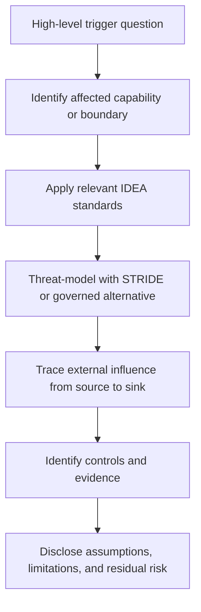

# Security Review Trigger Checklist

## Purpose

This checklist is a high-level discovery tool for identifying areas of a project
that warrant deeper security review.

It is intentionally capability-oriented rather than implementation-specific.  A
positive answer identifies review scope; it does not establish that a
vulnerability exists.  A negative answer is not evidence that the project is
secure.

Reviewers SHOULD use this checklist to decide where deeper IDEA, STRIDE,
trust-boundary, source-to-sink, or control-specific analysis is warranted.

The checklist is not a substitute for the detailed security standards.

## How to Use This Checklist

For an initial review:

1. answer each question at a project or subsystem level;
2. record uncertainty rather than guessing when the answer is unknown;
3. follow positive or uncertain answers into the indicated deeper-review areas;
4. identify material trust boundaries that emerge from those answers; and
5. update the review when the project's capabilities or architecture materially
   change.

A project does not need a security finding for a question to matter.  The purpose
is to expose attack surface, authority, trust, and failure consequences early.

## Network and External Communication

- [ ] **Does the project listen for inbound network traffic?**  
  Probe authentication, authorization, protocol parsing, encryption, exposure,
  rate limits, denial of service, and trust boundaries.

- [ ] **Does the project initiate outbound network connections?**  
  Probe destination control, TLS validation, data disclosure, request
  construction, credential use, egress restrictions, and externally influenced
  URLs or hostnames.

- [ ] **Does the project communicate with external services, APIs, queues, or
  brokers?**  
  Probe service identity, authorization, data provenance, replay, availability,
  error handling, and assumptions about the external system.

## Filesystem and Persistent State

- [ ] **Can externally influenced values affect which files or directories are
  read?**  
  Probe path validation, traversal, symbolic links, permissions, file types,
  canonicalization, and information disclosure.

- [ ] **Can externally influenced values affect which files or directories are
  written, replaced, deleted, or created?**  
  Probe path confinement, overwrite behavior, permissions, atomicity, symbolic
  links, persistence, and privilege.

- [ ] **Does the project persist state that will later influence security-sensitive
  behavior?**  
  Probe provenance, tampering, freshness, lifecycle, migration, invalidation,
  and assumptions made when the state is read again.

## Process, Code, and Tool Execution

- [ ] **Does the project execute external programs, shells, scripts, interpreters,
  plugins, hooks, or generated code?**  
  Probe argument construction, shell interpretation, executable selection,
  environment inheritance, plugin trust, capability, and command injection.

- [ ] **Can externally influenced data select what code, module, plugin, workflow,
  or executable runs?**  
  Probe data/control separation, allow-listing, provenance, authorization, and
  privilege escalation.

- [ ] **Does the project generate code, commands, workflows, configuration, or
  other material that another component may execute?**  
  Probe transformation boundaries, validation, provenance, signing, and whether
  generated data can become control.

## External Input and Parsing

- [ ] **Does the project consume command-line arguments, environment variables,
  configuration, standard input, files, network data, repository content, or
  other externally influenced input?**  
  Probe taint, validation for the intended sink, bounds, canonicalization, and
  assumptions about origin.

- [ ] **Does the project parse or deserialize structured data from outside its own
  controlled logic?**  
  Probe parser behavior, malformed input, unsafe types, schema validation,
  resource exhaustion, and data/control confusion.

- [ ] **Can input that is valid in one context later be reused in another
  security-sensitive context?**  
  Probe whether validation is being treated as transitive rather than
  re-established for the later sink.

## Identity, Credentials, and Authorization

- [ ] **Does the project authenticate humans, services, workloads, devices, or
  automated agents?**  
  Probe identity proof, credential lifecycle, trust anchors, revocation,
  expiration, and auditability.

- [ ] **Does the project make authorization or access-control decisions?**  
  Probe policy boundaries, least privilege, default-deny behavior, delegation,
  object-level authorization, and whether authentication is being mistaken for
  authority.

- [ ] **Does the project handle credentials, secrets, private keys, certificates,
  tokens, or signing material?**  
  Probe storage, scope, exposure, rotation, revocation, inheritance, logging,
  backup, and compromise recovery.

## Privileged Mutation and External Effects

- [ ] **Can the project mutate repositories, infrastructure, deployments,
  accounts, external services, or other consequential state?**  
  Probe identity, authorization, approval boundaries, least capability,
  auditability, fail-closed behavior, and rollback.

- [ ] **Can a less-privileged component influence a more-privileged component?**  
  Probe narrow interfaces, validation at the privileged boundary, confused
  deputy risks, data/control separation, and independent authorization.

- [ ] **Does one component possess capabilities that are unrelated to its primary
  responsibility?**  
  Probe whether filesystem, network, credential, process, or mutation authority
  can be removed or separated.

## Supply Chain and Artifact Flow

- [ ] **Does the project download, build, transform, package, minify, sign,
  publish, or distribute artifacts?**  
  Probe provenance, integrity, build isolation, transformation boundaries,
  signing identity, generated-artifact testing, and consumer verification.

- [ ] **Does the project dynamically obtain dependencies, tools, containers,
  plugins, actions, or executables?**  
  Probe source authenticity, version pinning, integrity verification, update
  policy, trust roots, and compromise impact.

## Sensitive Data and Cryptography

- [ ] **Does the project process confidential, personal, regulated, security-
  sensitive, or otherwise high-consequence data?**  
  Probe collection, minimization, authorization, encryption, retention,
  disclosure, logging, deletion, and failure behavior.

- [ ] **Does the project use cryptography for confidentiality, integrity,
  authentication, signing, or provenance?**  
  Probe the exact property being claimed, key management, algorithm and protocol
  use, trust anchors, freshness, replay, and whether cryptographic success is
  being mistaken for universal trust.

## Resource Consumption and Availability

- [ ] **Can external input materially influence CPU, memory, storage, network,
  process count, model context, queue depth, or execution time?**  
  Probe bounds, quotas, timeouts, backpressure, cancellation, isolation, and
  denial-of-service behavior.

- [ ] **Could failure of a security control prevent the system from performing a
  critical function?**  
  Probe availability dependencies, fail-closed behavior, degraded modes,
  redundancy, and explicitly accepted tradeoffs.

## Automation and Agentic Systems

- [ ] **Does the project include automation or agents that interpret untrusted
  text, repository content, issue content, documents, or generated output?**  
  Probe prompt or instruction injection, data/control confusion, taint,
  capability boundaries, credential isolation, and privileged mediation.

- [ ] **Can automated output directly trigger tools, network requests, code
  execution, publication, deployment, or other consequential actions?**  
  Probe whether the output is treated as data, whether the receiving boundary
  validates and authorizes the action independently, and whether capabilities are
  technically constrained.

## Negative-Space Questions

These questions are useful even when the project appears small or low-risk.

- [ ] **Is anything trusted primarily because it is local, internal, familiar, or
  produced by another project component?**

- [ ] **Is anything trusted primarily because it came from an authenticated or
  encrypted connection?**

- [ ] **Can data become control anywhere in the system?**

- [ ] **Can one compromised component obtain unrelated authority or move laterally
  into another security domain?**

- [ ] **Is there a material security claim for which the project has little or no
  meaningful evidence?**

- [ ] **Is there a boundary whose failure would undermine most or all of the
  system's other security assumptions?**

A positive or uncertain answer to one of these questions SHOULD trigger a deeper
review of the relevant assumption or boundary.

## Moving From Trigger to Analysis

The checklist identifies where to look next.

A typical progression is:

Not every positive answer requires a formal threat model.  Review depth SHOULD be
proportionate to consequence, privilege, exposure, sensitivity, and uncertainty.

## Relationship to the Security Commandments

This checklist is primarily a discovery aid for applying the commandments.

In particular:

- **SEC-01** and **SEC-06** prompt reviewers to identify hidden trust boundaries;
- **SEC-02** and **SEC-05** prompt review of externally influenced data and sinks;
- **SEC-03** prompts review of data becoming control;
- **SEC-04** prompts identity and authorization review;
- **SEC-07** prompts capability and privilege review;
- **SEC-08** prompts review of consequential crossings;
- **SEC-09** prompts containment and blast-radius review;
- **SEC-10** prompts failure-behavior review;
- **SEC-11** prompts evidence review; and
- **SEC-12** prompts disclosure of assumptions and residual risk.

## Governing Principle

Use the checklist to discover where trust, authority, external influence, or
failure consequences deserve closer examination.

A checked box means "review this more deeply," not "a vulnerability exists."
An unchecked box means only that the reviewer did not identify that capability;
it does not establish security.
